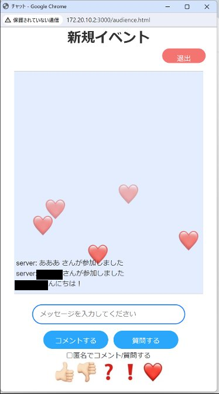
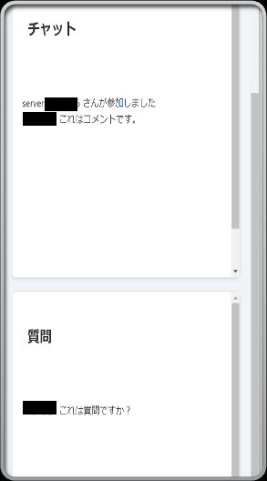
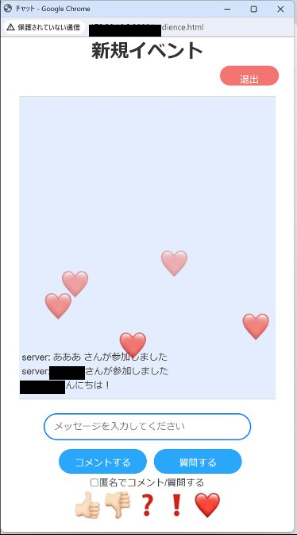
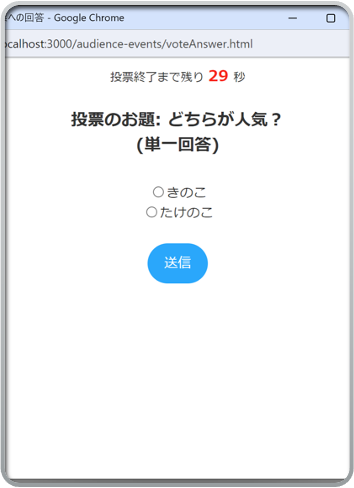
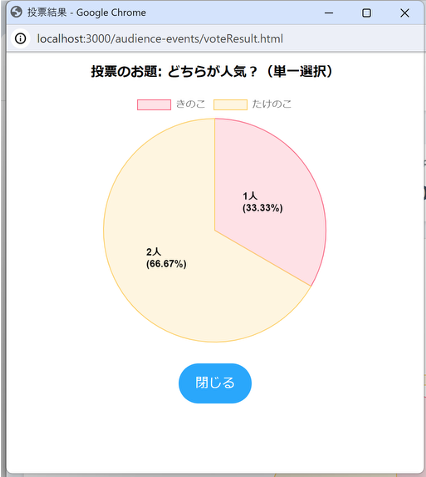

# SNS型webアプリケーション
- 大学の講義にて、5人チームで作成。

## 概要
- 発表の場において、発表者と聴講者がリアルタイムで、意見やリアクションのやり取りをすることができる。
- 投票機能がある。
- コメント、質問機能がある。
- リアクション機能がある。
- 複数クライアントが同時に接続できる。（20人程度が同時に接続しても問題なく動作することを確かめた。）

## 画面イメージ

